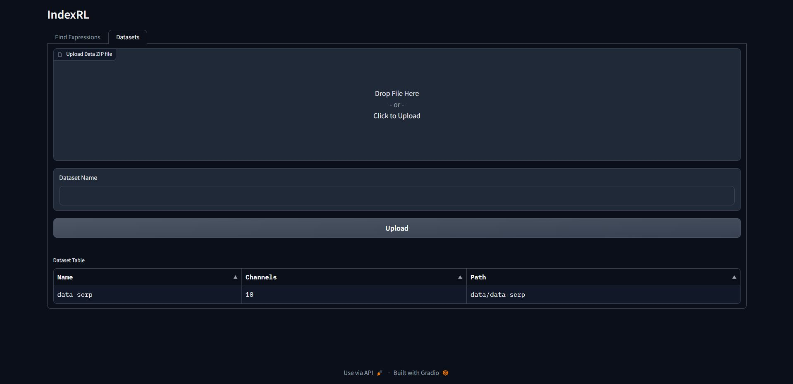
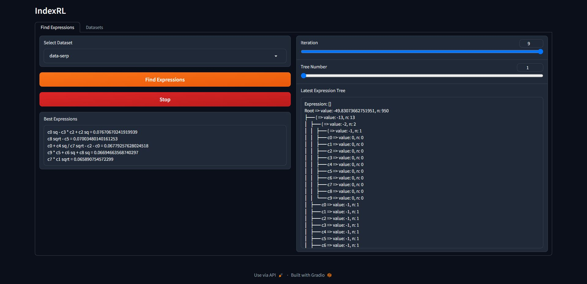

# IndexRLApp
Gradio app to generate remote sensing indices for properties defined by image-mask pairs.

## How to Install
IndexRL can be installed using the following two commands. However, it is recommended that you create a virtual environment prior to pip installation.

```cmd
pip install -r requirements.txt
python app.py
```

## Upload a Dataset
1. Set up the file structure of your dataset as follows.

```
.
└── dataset/
    ├── images/
    │   ├── img1.npy
    │   ├── img2.npy
    │   └── ...
    └── masks/
        ├── mask1.npy
        ├── mask2.npy
        └── ...
```

2. Create a zip file for the dataset
```cmd
cd dataset
zip -r dataset.zip *
```

3. Go to the `Datasets` tab on IndexRL, upload the created zip file, give a name for the dataset, and press the `Upload` button.



## Generate Remote Sensing Indices

1. Go to the `Find Expressions` tab, select the dataset from the dropdown and click the `Find Expressions` button. With time, more and more expressions will be generated.


2. Obtain the top 5 expressions from the `Best Expressions` box.

3. Visualize and debug the expression search tree from the panels on the right.
    - `Iteration` refers to each generated expression.
    - `Tree Number` refers to the index of the expression tree that resulted in the selection of each symbol of the expression.
    - `Expression Tree` displays the tree of symbols explored by the RL agent and the scores observed if each of those symbols were chosen. As you change the `Tree Number`, you can observe how the tree for the next choice of symbol.



